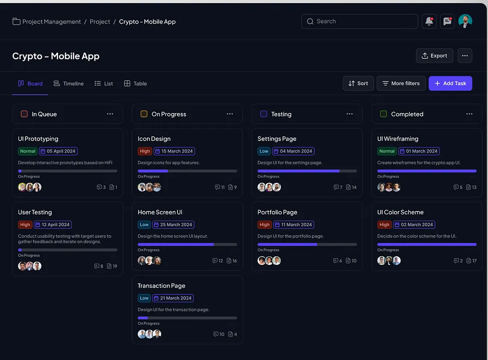
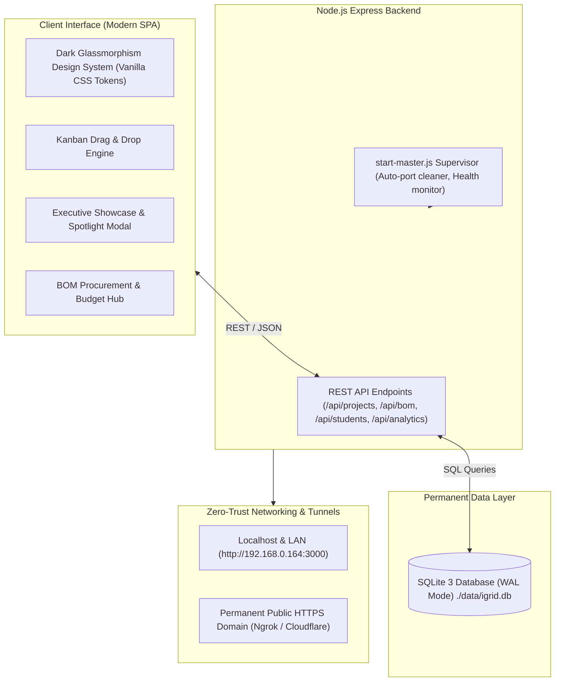

# 🚀 IGRID Innovation Lab - Project Management & Executive Showcase System

<p align="center">
  
</p>

<p align="center">
  
  
  
  
  
  
</p>

---

## 📖 Executive Summary

The **IGRID Innovation Lab Project Management & Showcase System** is a full-stack, self-hosted management and evaluation platform designed specifically for research and innovation labs focused on **AI & Computer Vision, Robotics & Manipulators, Drones & UAVs, IoT & Smart Grid, and Embedded Systems & FPGA**.

It bridges the gap between **daily student engineering** (sprint tasks, blockers, GitHub commits, BOM requisitions) and **executive management oversight** (lab director review, budget approvals, video demonstrations, LinkedIn innovation posts, and stakeholder presentations).

---

## ✨ Core Features & Capabilities

### 1. 🌟 Executive Management Showcase View
* **High-Impact Prototype Imagery**: Visual showcase featuring high-resolution hardware photos and CAD renderings.
* **Student Team & Lead Portraits**: Profile headshots, roles, and university roll numbers.
* **Live Completion Meter**: Radial sprint progress meters with stage indicators.
* **Urgent Procurement Alerts**: Instant banner highlights when critical hardware components require Lab In-Charge sign-off.
* **Integrated Media Hub**:
  - 🐙 **GitHub Repository** direct links.
  - 🎥 **YouTube Video Flight Tests & Demos**.
  - 💼 **LinkedIn Innovation Showcase Posts**.
  - 📄 **Technical Datasheets & Schematics**.

### 2. 🔍 Interactive Presentation Spotlight Modal
* Designed for displaying projects to **Lab Directors, University Deans, Accreditation Inspectors, and External Evaluators**.
* Fullscreen presentation mode with high-resolution prototype banners, engineering abstracts, live Bill of Materials tables with 1-click approvals, and student roster cards.

### 3. 📋 Kanban Prototyping Board
* HTML5 drag-and-drop workflow across sprint phases:
  - 🔴 **In Queue / Ideation**
  - 🟡 **On Progress / Prototyping**
  - 🔵 **Testing & BOM Review**
  - 🟢 **Completed & Deployed**
* Priority indicators (🔥 High, 🟢 Normal, 🔵 Low), glowing gradient progress meters, and dynamic card counters.

### 4. 💎 Lab Bill of Materials (BOM) Procurement Hub
* Lab procurement manager with real-time budget tracking.
* 1-Click Lab In-Charge **Approve / Reject** workflow.
* Tracks Part Numbers, Component Categories (Sensors, Actuators, Compute, Power, Chassis), Quantities, Unit Prices, and Total Cost.

### 5. 🏷️ Multi-Domain & Trending Hashtag Filters
* Instant filtering across 5 innovation domains: **AI, Robotics, Drones, IoT, Embedded**.
* Trending hashtag cloud (`#ROS2`, `#EdgeAI`, `#YOLOv8`, `#JetsonOrin`, `#PX4`, `#LoRaWAN`, `#SLAM`, `#CANBus`, `#FPGA`).
* Standardized tracking identifiers (`IGRID-AI-01`, `IGRID-ROB-02`, `IGRID-DRN-03`, `IGRID-IOT-04`, `IGRID-EMB-05`).

### 6. 📊 Timeline (Gantt), List & Editable Data Grid (Table)
* **Timeline View**: Visual sprint roadmap from ideation to deployment.
* **List View**: Standup blockers, immediate action items, and next steps.
* **Table View**: Live editable spreadsheet data grid with inline dropdowns.

### 7. 👥 Student Innovator Directory
* Comprehensive student registry tracking academic year, enrolled domain, roll numbers, and active project assignments.

### 8. ⚡ Windows Auto-Start on Boot & Permanent Public Domain
* Runs as a quiet background service on Windows startup via `%APPDATA%\Microsoft\Windows\Start Menu\Programs\Startup\IGRID_Lab_AutoStart.vbs`.
* Connected to a permanent, fixed public HTTPS domain that **never changes across computer restarts**.

---

## 🏗️ Architecture & Technology Stack



| Layer | Technologies |
| :--- | :--- |
| **Frontend** | Vanilla HTML5, Modern CSS3 (Glassmorphism, CSS Custom Properties, HSL color tokens), Vanilla ES6+ JavaScript |
| **Backend** | Node.js, Express.js REST API, CORS middleware |
| **Database** | SQLite3 with WAL (Write-Ahead Logging) mode (`./data/igrid.db`) |
| **Containerization** | Docker, Docker Compose (Alpine Node 20 base) |
| **Networking** | Cloudflare Tunnel & Ngrok Permanent Domain with automatic fallback |

---

## 🚀 Getting Started & Deployment

### Option 1: 1-Click Launch (Windows)
Double-click [`START_IGRID_DASHBOARD.bat`](./START_IGRID_DASHBOARD.bat) in the project folder. This will:
1. Start the Express backend server on `http://localhost:3000`.
2. Connect your permanent public HTTPS domain.
3. Automatically launch your browser.

### Option 2: Run with Docker Compose
```bash
# Build and run container in detached mode with persistent volume
docker compose up -d --build

# View container logs
docker compose logs -f

# Stop container
docker compose down
```

### Option 3: Standard Node.js Execution
```bash
# Install dependencies
npm install

# Start master supervisor (Server + Public Domain)
node start-master.js

# Or start backend server only
node server.js
```

---

## 🌐 Network & Access Endpoints

| Environment | Access URL | Description |
| :--- | :--- | :--- |
| 🌍 **Permanent Public HTTPS** | **`https://kabob-suspect-mandate.ngrok-free.dev`** | Accessible anywhere worldwide (free SSL) |
| 💻 **Local PC** | **`http://localhost:3000`** | Direct local access |
| 📡 **Lab Wi-Fi / Local Network** | **`http://192.168.0.164:3000`** | Direct access for devices inside the lab |

---

## 🔌 REST API Documentation

### Projects API
| Method | Endpoint | Description |
| :--- | :--- | :--- |
| `GET` | `/api/projects` | Fetch all projects with optional query filters (`?domain=AI&status=in_progress&search=ROS2`) |
| `GET` | `/api/projects/:id` | Fetch detailed project metadata, BOM subtable, and comments thread |
| `POST` | `/api/projects` | Create a new innovation project / task |
| `PUT` | `/api/projects/:id` | Update project metadata, status, progress, media links, action items |
| `PATCH` | `/api/projects/:id/status` | Instant status change (used for Kanban drag-and-drop) |
| `DELETE` | `/api/projects/:id` | Delete project and associated records |

### BOM Requisitions API
| Method | Endpoint | Description |
| :--- | :--- | :--- |
| `GET` | `/api/bom` | List all component requisitions across all teams |
| `POST` | `/api/bom` | Submit a new component requisition for approval |
| `PATCH` | `/api/bom/:id/status` | Lab In-Charge action (`approved`, `rejected`, `pending`) |
| `DELETE` | `/api/bom/:id` | Remove a BOM requisition |

### Students & Analytics API
| Method | Endpoint | Description |
| :--- | :--- | :--- |
| `GET` | `/api/students` | List all registered student researchers |
| `POST` | `/api/students` | Register a new student innovator |
| `GET` | `/api/analytics` | High-level lab KPI summary (Average progress, approved budget, pending BOMs) |
| `GET` | `/api/export/csv` | Download complete project database as CSV spreadsheet |
| `GET` | `/api/export/json` | Download full database dump in JSON format |

---

## 📁 Repository Structure

```
IGRID project management dashboard/
├── 📄 server.js                     # Express REST API Server
├── 📄 database.js                   # SQLite Database schema, migrations & seed data
├── 📄 start-master.js               # Supervisor process (Express + Tunnel sync)
├── 📄 config.json                   # Tunnel & port configurations
├── 📄 Dockerfile                    # Container definition (Alpine Node 20)
├── 📄 docker-compose.yml            # Docker Compose service with volume mount
├── 📄 package.json                  # Node.js project manifest & dependencies
├── 📄 .gitignore                    # Git ignore rules
│
├── 📂 public/                       # Frontend Single Page Application
│   ├── 📄 index.html                # Main UI markup & modals
│   ├── 📂 css/
│   │   └── 📄 style.css             # Dark glassmorphism design system
│   └── 📂 js/
│       └── 📄 app.js                # State management, Kanban DnD, showcase engine
│
├── 📂 data/                         # Permanent SQLite database storage
│   └── 📄 igrid.db                  # Live database file
│
├── 📂 docs/                         # Documentation assets & screenshots
│   └── 📂 screenshots/
│       └── 📄 kanban_board_ui.png   # Working application screenshot
│
├── 📄 START_IGRID_DASHBOARD.bat     # 1-Click Master Launcher
├── 📄 STOP_IGRID_DASHBOARD.bat      # 1-Click Stop Services
├── 📄 install-auto-startup.bat      # Windows boot auto-start installer
├── 📄 uninstall-auto-startup.bat    # Windows boot auto-start remover
├── 📄 docker-start.bat              # 1-Click Docker launcher
└── 📄 docker-stop.bat               # 1-Click Docker stop
```

---

## 👥 Authors & Credits

* **Developed For**: **IGRID Innovation Lab**
* **Repository**: [https://github.com/igridlab-code](https://github.com/igridlab-code)
* **License**: MIT Open Source License
